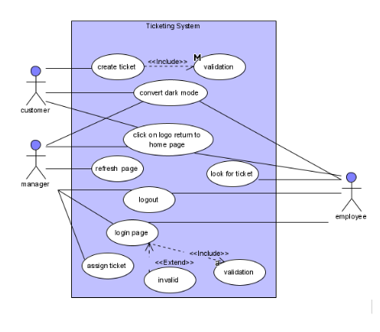
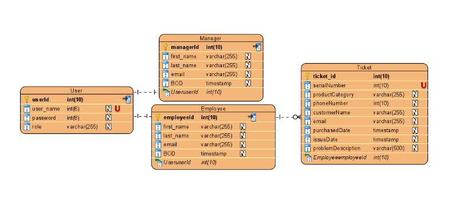

# Ticketing System (CRUD)

## Problem definition statement:
“to enhance the quality of customer service and experience at SonyBuy In addition, they have no way to communicate with customers  ”
## Issues:
customer support manager want to enhance the quality of customer service and experience  In addition .SonyBuy customers when they encounter problems there is no clear and direct way to contact the company to tell them about the problems
## possible solutions:
The IT manager was tasked with building a ticketing system by the customer support manager
The system will be able to enable the customer to open a ticket and fill in the problem information and the manager will manage this ticket and assign employees to solve it

## User requirements:

### Manger
- login 
- assign ticket
- refresh  page and return only ticket that not assign for any employee
- logout
- convert from Light mode to Dark mode
- if click on logo it we return to home page

### Employee
- login
- look for ticket that assigned to him
- logout
- convert from Light mode to Dark mode
- if click on logo it we return to home page

### Customer
- open a ticket
- filling information ticket 
- convert from Light mode to Dark mode
- send button for send ticket
- if click on logo it we return to home page

## System requirements:
- Quick load time
- the ticketing system will allow to manager and employees login on system 
- the ticketing system will allow to manager and employees logout on system 
- the ticketing system will check in database(validation) if this employee/manager allow to login system
- the ticketing system will allow manager to assign ticket for employees
- the ticketing  system will allow manager refresh page and return only ticket that not assign for any employee
- the ticketing system will allow customer to open a ticket and filling information then send by click on send button  
- the ticketing system will allow for employees to look for ticket that assigned to him
- the ticketing system will allow customer/manager /employee click on logo it we return to home page
- the ticketing system will allow customer/manager /employee to convert from Light mode to Dark mode

## functional requirements:
- the ticketing system shall allow manager to login
- the ticketing system shall allow manager to logout
- the ticketing system shall allow manager to assign ticket for employee 
- the ticketing system shall allow manager to refresh page and return only the ticket that not    assigned for any employee
- the ticketing system shall allow customer to open a new ticket 
- the ticketing system shall allow customer to fill ticket information
- the ticketing system shall allow customer to send ticket information by click button
- the ticketing system shall allow employees to login 
- the ticketing system shall allow employees to logout
- the ticketing system shall allow employees to look for ticket that assigned to him
- the ticketing system shall allow employees /manager/customer convert from Light mode to Dark mode
- the ticketing system shall allow employees /manager/customer if click on logo it we return to home page

## non-functional requirements:
- the system shall be easy to use
- the system shall be user friendly
- the system shall be good performance
- the system shall be high functionality 
- the system shall be flexible
- the system shall be secure

## Use-Case Diagram

## Entity-relationship diagram (ERD):

